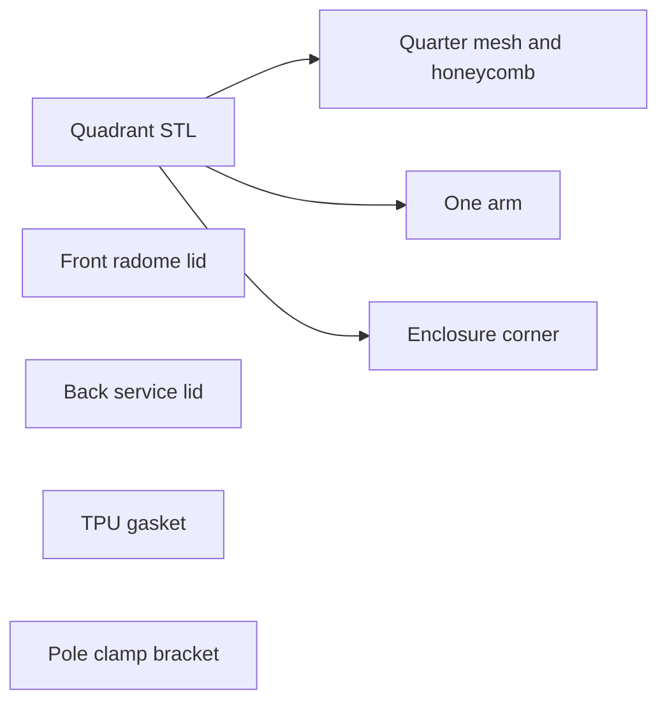

# 5.8 GHz mesh parabolic dish

New model [`models/58ghz_mesh_dish.scad`](models/58ghz_mesh_dish.scad), same style as [`models/feedhorn_58ghz.scad`](models/feedhorn_58ghz.scad): millimeter units, Customizer assignments, no libraries, header `// name:` and `// description:` so [`scripts/catalog.py`](scripts/catalog.py) picks it up. Rebuild the catalog with `python3 scripts/catalog.py`.

Default diameter is **400 mm**. Focal length is **150 mm** (f/D = 0.375, depth 66.67 mm). Vertex at the origin, focus at `z = focal_length`, dish opening toward +Z. The pole lies on the back of the dish along +Y, and +Y is up when installed. Diameter and focal length stay parameters. The dish is a plastic substrate for conductive paint and electroplating. The front lid stays unplated radome plastic.

## Mesh

`lambda_mm = 299.792458 / frequency_GHz` is **51.69 mm** at 5.8 GHz. The clear opening along the surface is `mesh_opening_lambda * lambda_mm`, default **0.1** (λ/10 ≈ 5.17 mm). Rim slope is `atan(D / (4f))` ≈ 33.7°, so the plan-view gap of the vertical rib grid is the surface gap times `cos(slope)`:

- XY opening ≈ **4.30 mm**
- Rib width **1.2 mm**
- XY pitch ≈ **5.5 mm**, about 66% open area

Echo wavelength, XY opening, pitch, and open fraction. `fast_preview` coarsens only the RF grid for F5.

The skin is a `rotate_extrude` paraboloid about **1.2 mm** thick measured along the normal. The RF grid is the intersection of that shell with vertical ribs in X and Y. Openings stop at the hub. Behind the skin, a honeycomb of ribs at 0°, 60°, and 120°, about **24 mm** across and **10 mm** deep, with **2.4 mm** ribs. A solid rim hoop closes the edge and lands the arms.

## Hub and pole bracket

Inside `hub_radius` (about **45 mm**) the skin is solid and thicker. Each quadrant of that pad has one bolt hole. The pole bracket is its own part: a saddle for `pole_diameter` (default **32 mm**) with two hose-clamp stations. Default band **12.7 mm** wide by **2.5 mm** clearance. Each station is a pair of slots the clamp passes through and then around the pole. The bracket bolts to the four hub pads.

## Focal enclosure and arms

`enclosure_size` defaults to **50** and is the outer cube, centered on the focus. The body is an open square tube, wall about **2 mm**. The face toward the dish (−Z) and the face away (+Z) are closed by lids. The cube is rotated 45° about Z so its corners point at 0°, 90°, 180°, and 270°.

Four rectangular-prism arms run from the rim hoop to those corners. `arm_width` and `arm_height` default to about **14 mm** by **6 mm**. The cross-section is constant. Endpoints come from the current enclosure size, and the prism lies on the segment between them:

- Rim end: on the rim hoop at that azimuth, `z = r^2 / (4f)`
- Enclosure end: the corner, `r = (enclosure_size/2)*sqrt(2)`, at the focal plane

The broad face of each prism is the print-bed face. The **270° (−Y)** arm is hollow, parallel to the pole, and is the bottom arm when installed. Its bore (`feed_bore_width` / `feed_bore_height`, about **8 mm** by **3 mm**) enters the cavity through the side wall beside the screw post and exits at a downward rim mouth, which is the low end of the bore. The bore stays clear of the screw pilot and the gasket land. The other three prisms are solid. Assert the corner stays inside the rim and the arm length stays positive, and echo the arm angle.

## Lids and gasket

Front and back lids are whole parts. Four corner posts on the body take the screws, one post per quadrant for each lip. Each post has a blind M3 pilot (about **2.5 mm**) that ends inside the post, outboard of the cavity. Each lid hole is an M3 clearance (about **3.2 mm**) with a **90°** countersink for a bevelled head, deep enough for the head to sit flush.

The gasket path is a rounded rectangle inset from all four screws. The groove is in the lid. The body has a flat land on that same path, a continuous seat around the opening, with the posts standing outside it. Each quadrant prints a solid quarter of the land, and the quarters meet flush on the cut planes. The gasket is a separate TPU loop, slightly proud of the groove. One gasket geometry; print two.

The front lid is the radome: a thick rim for the countersinks and the groove, and a window `radome_thickness` default **1.2 mm**. The back lid is a service cover of normal thickness with the same screw and gasket pattern.

## Print sections

`part` selects `assembly`, `quadrant_1` … `quadrant_4`, `front_lid`, `back_lid`, `gasket`, or `pole_bracket`.

Each quadrant is one solid: quarter dish (mesh, honeycomb, rim, hub pad), one arm, and one enclosure corner. Cuts are the planes at 45° and 135°. The −Y quadrant carries the hollow arm. Radial seams have a lap flange and M3 holes. The hub bolts through the pole bracket pull the center together.

Assembly view stays in dish coordinates. Quadrant STLs use the print pose:

- Pitch by the computed arm angle and flip, so the prism axis is horizontal and its broad face is parallel to the bed.
- Translate so the lowest point lies on `z = 0`. The enclosure’s outer corner is about **22 mm** past the arm centerline and shares that plane with the prism face. Stacked height is about **188 mm**.
- Yaw by `print_yaw`, default **50°**.

In that pose the quadrant is about **240 × 240 × 188 mm**. `printer_bed_mm` is **256**, and the assert measures this pose. `print_yaw` is the adjustment if a larger `enclosure_size` pushes a corner outside the bed.

## Check

Serve the workbench with `make serve` and open it in the browser. The catalog lists the new model. Render it with the in-browser OpenSCAD engine.

A failed assert shows in the error banner with the OpenSCAD log. A finished render shows the STL preview. Render `assembly`, one quadrant, `front_lid`, `gasket`, and `pole_bracket`. Confirm each render completes and the preview matches that part: the quadrant lies arm-down, the lid has four countersunk holes and a gasket groove, and the bracket has the hose-clamp slots.
